# GTSRB Federated Learning Training

In this example, we change the original example `hello-pt` (Resides in the same folder) to train a new model on a new dataset.
The dataset used is the German Traffic Sign Recognition Benchmark (GTSRB).
More details about the details and download information of the dataset can be found [here](https://benchmark.ini.rub.de/)
Moreover, we utilized `AlexNet` network from [this link](https://mailto-surajk.medium.com/a-tutorial-on-traffic-sign-classification-using-pytorch-dabc428909d7).

## Before you Run

In this section, we will discuss some assumptions before you run this example.
First, it is assumed that this NVFlare repository resides in the home folder, as follows: `~/NVFlare`.
Second, it is assumed that the virtual environment exists in the following path: `NVFlare/examples/hello-world/nvflare_example`.
If this is not the case, please consider changing this directory.
For more information about creating the virtual environment, please perform the following steps, which were inspired from [this link](https://nvflare.readthedocs.io/en/main/example_applications_algorithms.html) to create a virtual environment and install the required libraries when not using Cuda:

```bash
python3 -m pip install --user --upgrade pip
python3 -m pip install --user virtualenv
cd ~/NVFlare/examples/hello-world/
python3 -m venv nvflare_example
source nvflare_example/bin/activate
pip install --upgrade pip
pip install -r requirements.txt
pip install jupyterlab
```

To run NVFlare with CUDA (if you have a GPU), please consider the following steps.
Those steps are tested on Ubuntu 18.04.

```bash
wget https://repo.anaconda.com/archive/Anaconda3-2021.05-Linux-x86_64.sh # Install Anaconda
bash Anaconda3-2021.05-Linux-x86_64.sh
sudo apt-get install build-essential
sudo apt install python3-pip
sudo apt install gcc

# To remove previous installed cuda vesrion, if you do not have CUDA driver 11.1
sudo apt-get remove --purge nvidia\*
sudo apt-get autoremove
sudo apt-get install cuda-11.1

# Check NVIDIA installtion
cat /proc/driver/nvidia/version # Will output NVIDIA Kernel model

sudo apt-get remove nvidia-cuda-toolkit
sudo apt install nvidia-cuda-toolkit
nvcc -V # Will Display CUDA compilation tools version

# Create Anaconda environment with CUDA called nvflare.
conda env create -f nvflare_env.yaml # This file exists in the root folder of the NVFlare repository.
conda activate nvflare
```

The previous steps were developed by Ahmed Bakr.
Please refer to him for any questions.
For day to day usage, please consider using the following command to activate the virtual environment.

```bash
conda activate nvflare
... # Use the virtual environment
conda deactivate # When you are done using the virtual environment
```

Finally, it is assumed that the dataset is downloaded in the following path: `~/data/gtsrb/GTSRB`.
Now, you are ready to jump to the next section and run the example.

## Running without NVFlare

In this section, we will discuss how to run the program without NVFlare.
The python-script: `normal_training.py` is the main script that trains the model.

Now, we will discuss the parameters that can be changed in the script, as shown below in the following code snippet:

```python
gtsrb = GTSRB(  lr=0.01,
                    epochs=100,
                    batch_size = 128,
                    train_val_split = 0.8,
                    load_model_from_disk = False, # If True, the model will be loaded from the disk
                    model_load_path = os.path.abspath(os.path.join(dir_path, "model_99.pth"))) # The path of the model that should be loaded from the disk if load_model_from_disk is True
```

The model will be trained, the statistics will be printed in the console, and the graphs will be saved in the `ab-alex-net-gtsrb` folder.

```python
gtsrb.local_train(validate=True, save_graphs_after_each_epoch=True) # AB: Training the model
    gtsrb.display_train_trackers() # AB: Display the training trackers
```

The training loss is displayed below.

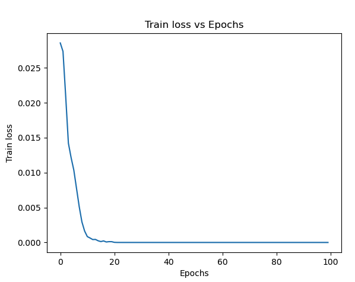

Moreover, the validation accuracy is displayed below.

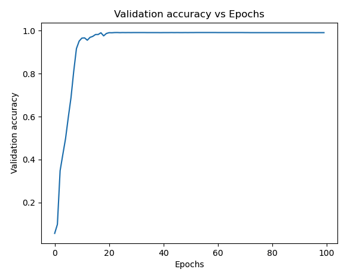

Finally, the model's performance will be tested on the test dataset and the final accuracy is displayed in the console.

```python
    validation_on_test_accuracy = gtsrb.validate(gtsrb.test_loader) * 100 # AB: Final validation on the test data
    print(f"Validation accuracy on test data: {validation_on_test_accuracy:.2f}%")
```

The final achieved accuracy is displayed in the console, as shown below.

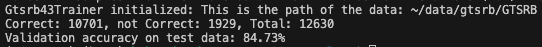

## How to Run using NVFlare

To be able to run the program, the dataset has to be downloaded by executing the following script from the CMD.
In the first line of this bash script, you will find the download folder location, which is set to be `~/data` by default.

```bash
bash prepare_dataset.sh
```

Second, the program can be run in the simulator mode or the Proof of Concept (POC) mode.
It is easier to run it first from a simulator to check that everything works by executing the following script.
In this script, it is assumed that the NVFlare folder is in the home directory `~/NVFlare`.
If this is not the case, please consider changing it.
Furthermore, it activates the virtual environment that is necessary to run NVFlare libraries in the second line.

```bash
bash ab-alex-net-gtsrb-simulator.sh
```

The same program can be run in POC mode, which is more realistic, as it depends on independent processes rather than threads that represent different clients.
To run in POC mode, execute the following command:

```bash
bash ab-alex-net-gtsrb-poc.sh # You might be asked to press `Y` in the CMD.
```

An admin panel will be displayed.
Use it to submit the task, as follows:

```bash
submit_job ab-alex-net-gtsrb
```

After the completion of the task (will be displayed in the CMD), close both the clients and the admin panels by executing the following commands from the admin panel.

```bash
shutdown client # You will be asked to type the admin's username: admin@nvidia.com
shutdown server # You will be asked to type the admin's username: admin@nvidia.com
```

The output of running the task in POC mode is inside the following path: `/tmp/nvflare/poc/example_project/prod_00/admin@nvidia.com`.
Note that this folder will be deleted upon the machine's restart.

## Things to Consider

Upon the change of the dataset folder from the assumed location, please consider changing it from the following files:

- Change the first line of the file `prepare_dataset.sh`.
- Change the following lines in the client's configuration file: `jobs/ab-alex-net-gtsrb/app/config/config_fed_client.json`:

```json
"datasetpath": "~/data/gtsrb/GTSRB",
"num_classes": 43,
"train_val_split" : 0.8,
"random_seed": 42,
```

### First experiment

We will run the program in PoC mode using the following configurations:

First, we change `config_fed_server.json` to have the following configurations:

```json
{
    "id": "scatter_and_gather",
    "name": "ScatterAndGather",
    "args": {
        "min_clients" : 2,
        "num_rounds" : 4,
        "start_round": 0,
        "wait_time_after_min_received": 10,
        "aggregator_id": "aggregator",
        "persistor_id": "persistor",
        "shareable_generator_id": "shareable_generator",
        "train_task_name": "train",
        "train_timeout": 0
}
```

For the clients, the following configurations are considered inside `config_fed_clients.json`:

```json
  "datasetpath": "../../../data", # Each client has his own dataset.
  "num_classes": 43,
  "train_val_split" : 0.8,
  "batch_size": 128,
  "executors": [
    {
      "executor": {
        "args": {
          "data_path": "{datasetpath}",
          "lr": 0.01,
          "epochs": 10,
```

We want to emphasize that we created our own script `jobs/split_data.py` to split the data between different clients.
Based on the previous configuration, the server waits for at least two clients to be connected and then starts the training process.
In the training process, the server gives the clients the task to train the model for 10 epochs.
After the training process is done, the server waits for the clients to send the trained models.
The server then aggregates the models and sends the aggregated model to the clients to be used in the next round.
The server repeats this process for 4 rounds.
Interestingly, the losses of the training at each client side is a little bit higher at 10, 20, 30, and 40 epochs.
This is because it has got the aggregated model from the server, which is a combination of the models of the clients.
The screenshot below shows the losses of the training at client 1 and client 2, respectively.

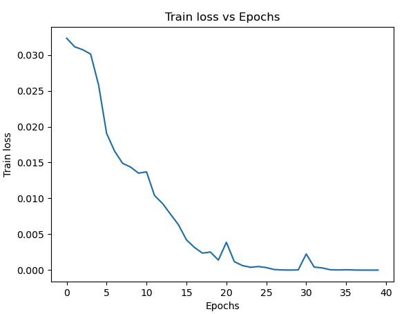

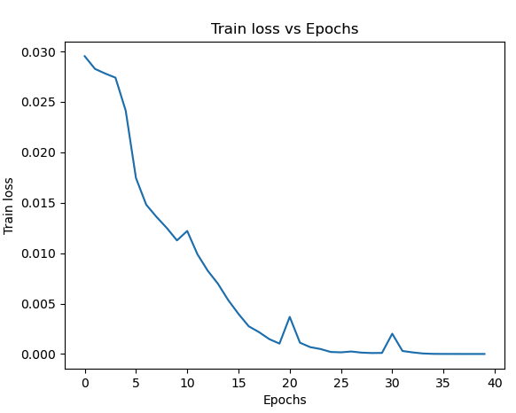

In addition, the following two images show the validation accuracy at each client side in the same order.

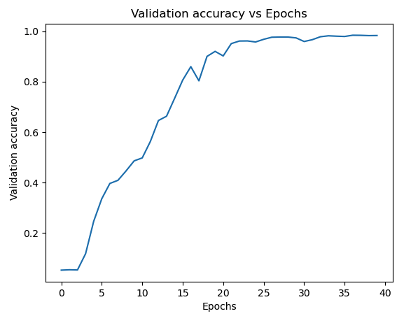

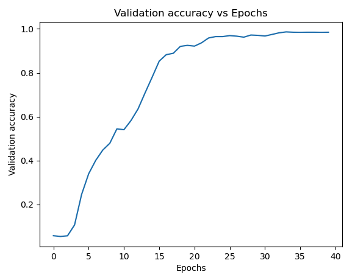

The models validation on the test data is done at the end of the training process, i.e., after 40 epochs of training.
The next screenshots show that the validation has been called three times for each client.
For example, for client 1, the validation process is called three time on its own test data, assuming that each client has its own test data.
We want to emphasize that we assumed in this experiment that all clients have the same test data, such as a well known benchmark dataset.
The first time on the server's model, the second time on its own model, and the third time on client's 2 model.
The snippet below is from client 1 log file.
It is obvious that when validating on the server's model, the accuracy is 0.862.
When validating on its own model, the accuracy is 0.8557.
When validating on client 2 model, the accuracy is 0.85787.
<!-- Important Note -->
I think this is because the server has not propagated the aggregated model after epoch 30, and from epoch 30 to 40, each client updated the last aggregated model (from epoch 30) with its own training data.
However, the server has received the latest models, after epoch 40 and aggregated them.
I think at this point, the server has not propagated back the aggregated models to the clients.
That is why we can find different accuracies when validating on the server's model, the client's own model, and the other client's model. 

```bash
2024-02-25 15:21:30,948 - Gtsrb43Validator - INFO - [identity=site-1, run=126ad075-27cd-4994-9b3a-5d8fc4dd205c, peer=example_project, peer_run=126ad075-27cd-4994-9b3a-5d8fc4dd205c, task_name=validate, task_id=996c4a83-a304-4661-984b-783b2d44e0ca]: Accuracy when validating SRV_server's model on site-1s data: 0.8623911322248614
...
2024-02-25 15:21:40,584 - Gtsrb43Validator - INFO - [identity=site-1, run=126ad075-27cd-4994-9b3a-5d8fc4dd205c, peer=example_project, peer_run=126ad075-27cd-4994-9b3a-5d8fc4dd205c, task_name=validate, task_id=5a7079e6-766d-441c-a08c-5390278dae55]: Accuracy when validating site-1's model on site-1s data: 0.8557403008709422
...
2024-02-25 15:21:50,421 - Gtsrb43Validator - INFO - [identity=site-1, run=126ad075-27cd-4994-9b3a-5d8fc4dd205c, peer=example_project, peer_run=126ad075-27cd-4994-9b3a-5d8fc4dd205c, task_name=validate, task_id=1eaf8c31-dcfe-44bf-8372-0aa16e50f477]: Accuracy when validating site-2's model on site-1s data: 0.8578780680918449
```

Below are the accuracies of the test reported by client 2.
We got the exact same accuracies as client 1, which is expected since the test data is the same for both clients.

```bash
2024-02-25 15:21:31,170 - Gtsrb43Validator - INFO - [identity=site-2, run=126ad075-27cd-4994-9b3a-5d8fc4dd205c, peer=example_project, peer_run=126ad075-27cd-4994-9b3a-5d8fc4dd205c, task_name=validate, task_id=08239a4e-6c30-44e4-81bd-b4eef35936bf]: Accuracy when validating SRV_server's model on site-2s data: 0.8623911322248614
...
2024-02-25 15:21:40,796 - Gtsrb43Validator - INFO - [identity=site-2, run=126ad075-27cd-4994-9b3a-5d8fc4dd205c, peer=example_project, peer_run=126ad075-27cd-4994-9b3a-5d8fc4dd205c, task_name=validate, task_id=e7654829-a8ac-4bec-a7f9-6e0757b16459]: Accuracy when validating site-1's model on site-2s data: 0.8557403008709422
...
2024-02-25 15:21:50,573 - Gtsrb43Validator - INFO - [identity=site-2, run=126ad075-27cd-4994-9b3a-5d8fc4dd205c, peer=example_project, peer_run=126ad075-27cd-4994-9b3a-5d8fc4dd205c, task_name=validate, task_id=9b2049c9-fc9f-4b08-8648-f123cbf51a19]: Accuracy when validating site-2's model on site-2s data: 0.8578780680918449
```

Moreover, the final validation accuracies show that the model converges to a good accuracy that is very close to the accuracy of the model trained on the whole dataset.
However, the model convergence is slower than the model trained on the whole dataset, where it almost saturates after 23 epochs in federated learning, while it saturates after 10 epochs in the normal training.

This experiment run for five minutes using NVFlare, while the same setup on a single client took more than 10 minutes.
The final aggregated model achieved 86.24% accuracy on the test data, while the model trained on the whole dataset achieved 84.8% accuracy on the test data.
The accuracy and the run time when training on the whole dataset without NVFlare are displayed in the following screenshot.

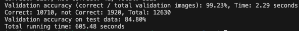

### Second experiment

Like the first experiment, we will run the program in POC mode.
Now, we will show the changes in the configurations and the results of the second experiment.
The training task on the client's side runs for 20 epochs, and this process is repeated twice.
This means that the server aggregates the models after epoch 20 and epoch 40.
This experiment is to show the effect of late aggregation on the final model's accuracy.

The training loss of client 1 and client 2 are shown below, respectively.

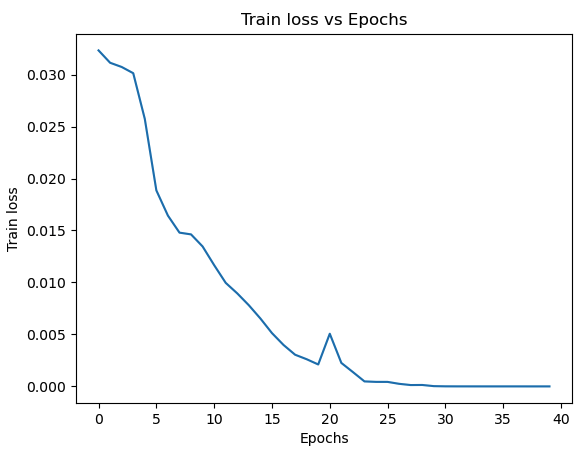
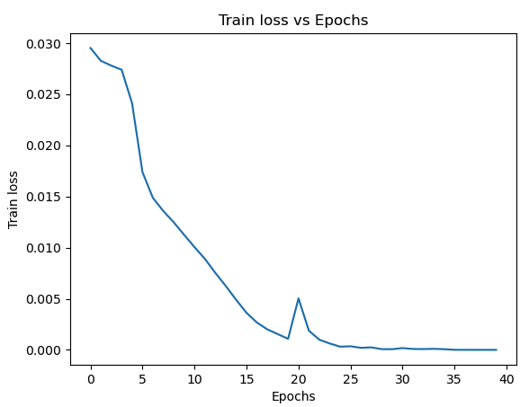

The same goes for the validation accuracies, which are reported as follows.

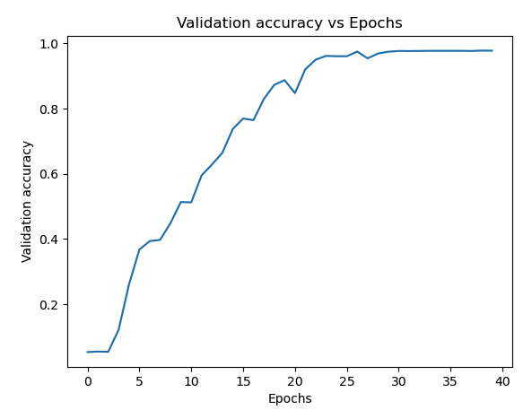
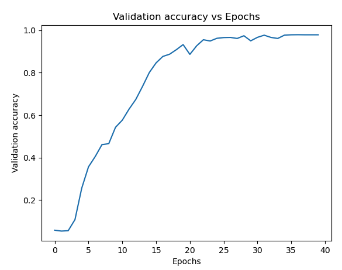

Finally, we will show the final validation accuracies on the test data.
Since both clients will report the same accuracies, as they both use the same test data, we will show only one of them.
Still, the server's aggregated model has the highest accuracy, which is 0.8567.
Although, it is slight lower than the accuracy reported when training on the clients side and aggregate after 10 epochs instead of 20.

```bash
2024-02-25 16:37:32,454 - Gtsrb43Validator - INFO - [identity=site-2, run=94d8ac69-6806-45ab-9beb-6a73945fd003, peer=example_project, peer_run=94d8ac69-6806-45ab-9beb-6a73945fd003, task_name=validate, task_id=6124a666-4a52-49b6-8764-4275eed836a9]: Accuracy when validating SRV_server's model on site-2s data: 0.856769596199525
...
2024-02-25 16:37:42,493 - Gtsrb43Validator - INFO - [identity=site-2, run=94d8ac69-6806-45ab-9beb-6a73945fd003, peer=example_project, peer_run=94d8ac69-6806-45ab-9beb-6a73945fd003, task_name=validate, task_id=ab255a60-8f7c-4785-a4a4-325bf9d64fa4]: Accuracy when validating site-1's model on site-2s data: 0.8463974663499604
...
2024-02-25 16:37:52,525 - Gtsrb43Validator - INFO - [identity=site-2, run=94d8ac69-6806-45ab-9beb-6a73945fd003, peer=example_project, peer_run=94d8ac69-6806-45ab-9beb-6a73945fd003, task_name=validate, task_id=74c44b36-e31c-48e5-85c6-2b7149a8e4e5]: Accuracy when validating site-2's model on site-2s data: 0.8534441805225653
```

The runtime of the experiment is 9 minutes.

### Third experiment

In this experiment, we will run the program in POC mode.
The training task on the client's side runs for 40 epochs, and the server aggregates the models in the end.
This is the worst scenario, as the server aggregates the models after the training process is done.
This experiment is to show the effect of late aggregation on the final model's accuracy.
The training loss of client 1 and client 2 are shown below, respectively.
We can note that the curve is smooth for both clients, since each client has not gotten any aggregated model from the server.

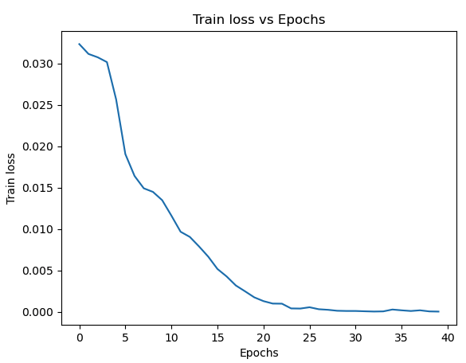
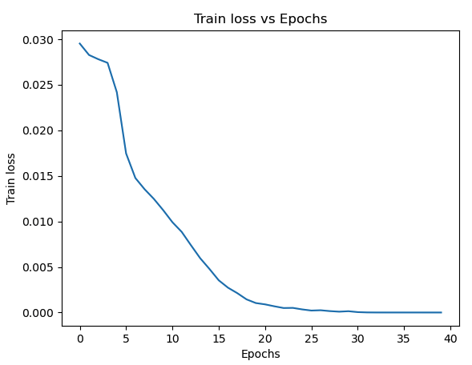

In addition, the validation accuracies are reported as follows.

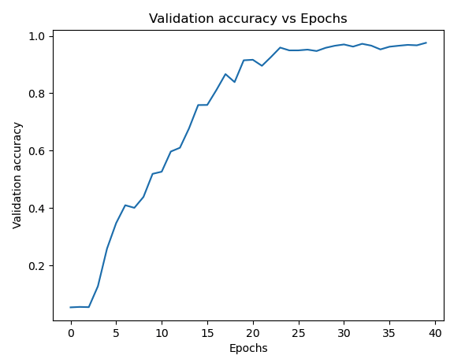
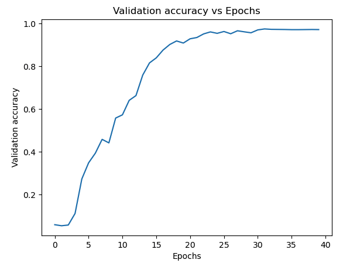

Finally, we will show the final validation accuracies on the test data for client 1.
The reporting below shows that this is the worst configuration, as the server's aggregated model has the lowest accuracy, which is 0.714.
Moreover, since each client has trained on half of the data, the accuracy of the model trained on the client's side is lower than the accuracies we got before in experiments 1 and 2.

```bash
2024-02-26 08:07:34,130 - Gtsrb43Validator - INFO - [identity=site-1, run=1258eb49-4221-4278-8807-074ff46617f5, peer=example_project, peer_run=1258eb49-4221-4278-8807-074ff46617f5, task_name=validate, task_id=432902dd-fa2d-4c71-90cd-1ee47df2b129]: Accuracy when validating SRV_server's model on site-1s data: 0.7147268408551068
...
2024-02-26 08:07:43,986 - Gtsrb43Validator - INFO - [identity=site-1, run=1258eb49-4221-4278-8807-074ff46617f5, peer=example_project, peer_run=1258eb49-4221-4278-8807-074ff46617f5, task_name=validate, task_id=ad3d626d-b24a-4f8b-a824-d108832ad2b0]: Accuracy when validating site-2's model on site-1s data: 0.813064133016627
...
2024-02-26 08:07:54,002 - Gtsrb43Validator - INFO - [identity=site-1, run=1258eb49-4221-4278-8807-074ff46617f5, peer=example_project, peer_run=1258eb49-4221-4278-8807-074ff46617f5, task_name=validate, task_id=fb980198-822e-4a71-9744-b2e9fb4e48ef]: Accuracy when validating site-1's model on site-1s data: 0.8206650831353919
```

The runtime of the experiment is 7 minutes.

### Fourth experiment

In this experiment, we are going to work with 4 clients.
Each one will receive 4 training requests from the server.
In each training process, the client will train the model for 10 epochs.
The server will aggregate the models after each training process, which means that the server will aggregate the models after 10, 20, 30, and 40 epochs.
The training loss of client 1, client 2, client 3, and client 4 are shown below, respectively.

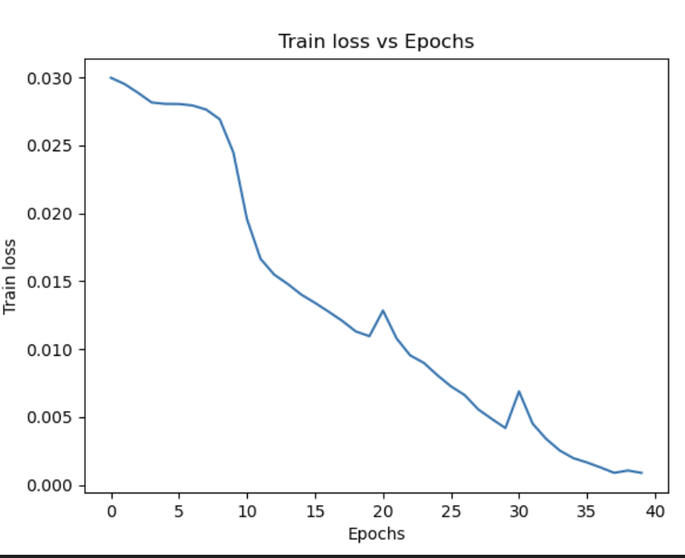
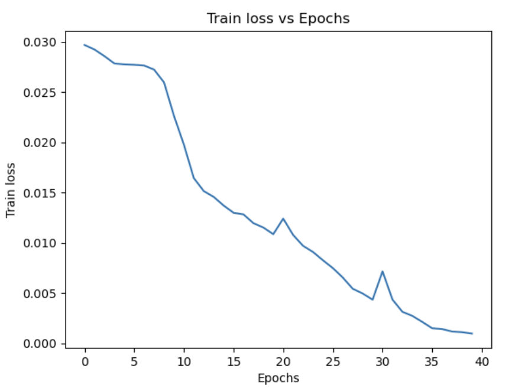
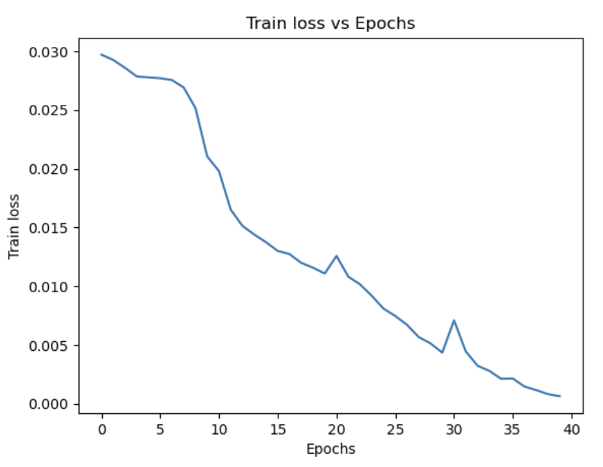
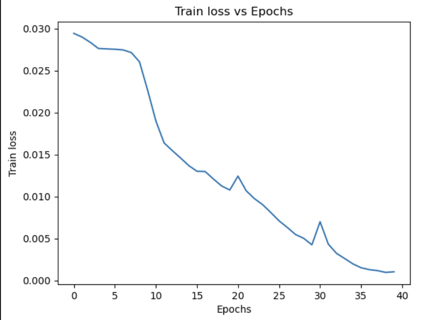

Moreover, the validation accuracies are reported as follows.

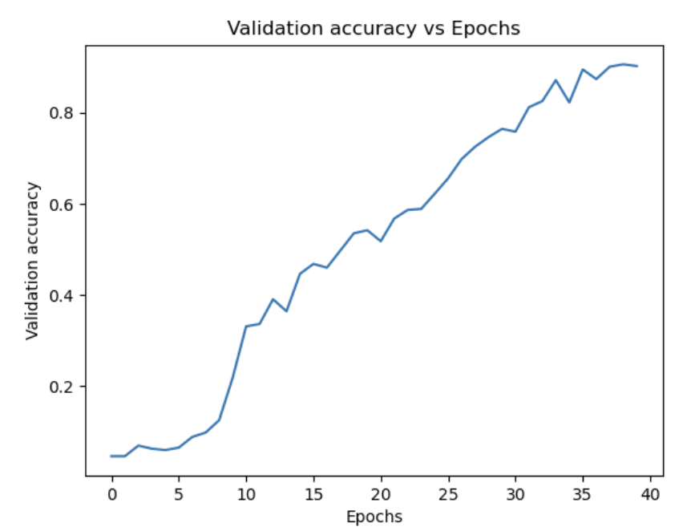

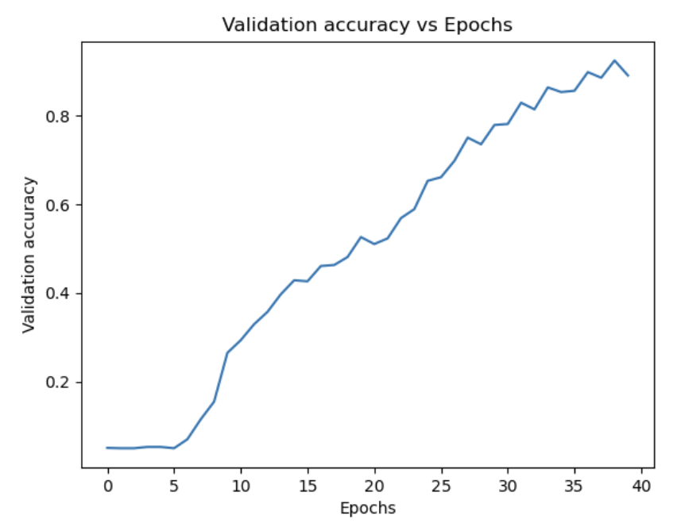
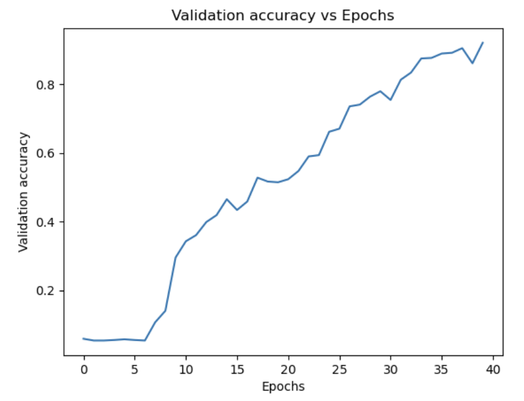

Finally, we will show the final validation accuracies on the test data for client 1.

```bash
2024-02-26 15:05:31,997 - Gtsrb43Validator - INFO - [identity=site-1, run=241bc3bf-b108-4b12-a96b-0cc1c817285b, peer=example_project, peer_run=241bc3bf-b108-4b12-a96b-0cc1c817285b, task_name=validate, task_id=3d377bcd-2fc4-4ccf-99f3-81e3edbf5c64]: Accuracy when validating SRV_server's model on site-1s data: 0.8904196357878068
...
2024-02-26 15:05:49,087 - Gtsrb43Validator - INFO - [identity=site-1, run=241bc3bf-b108-4b12-a96b-0cc1c817285b, peer=example_project, peer_run=241bc3bf-b108-4b12-a96b-0cc1c817285b, task_name=validate, task_id=fab84a15-620b-48d8-ae83-2143278da7fd]: Accuracy when validating site-3's model on site-1s data: 0.8680918448139351
...
2024-02-26 15:06:10,783 - Gtsrb43Validator - INFO - [identity=site-1, run=241bc3bf-b108-4b12-a96b-0cc1c817285b, peer=example_project, peer_run=241bc3bf-b108-4b12-a96b-0cc1c817285b, task_name=validate, task_id=5a1db54c-5597-4490-9e5b-101ca3359fca]: Accuracy when validating site-1's model on site-1s data: 0.8758511480601742
...
2024-02-26 15:06:30,111 - Gtsrb43Validator - INFO - [identity=site-1, run=241bc3bf-b108-4b12-a96b-0cc1c817285b, peer=example_project, peer_run=241bc3bf-b108-4b12-a96b-0cc1c817285b, task_name=validate, task_id=c10b6125-f14b-4951-9ffb-11293b4f7f62]: Accuracy when validating site-4's model on site-1s data: 0.8752969121140143
...
2024-02-26 15:06:48,255 - Gtsrb43Validator - INFO - [identity=site-1, run=241bc3bf-b108-4b12-a96b-0cc1c817285b, peer=example_project, peer_run=241bc3bf-b108-4b12-a96b-0cc1c817285b, task_name=validate, task_id=1db1151a-f6ca-456b-9859-57efc187d6a1]: Accuracy when validating site-2's model on site-1s data: 0.8718923198733175
```
